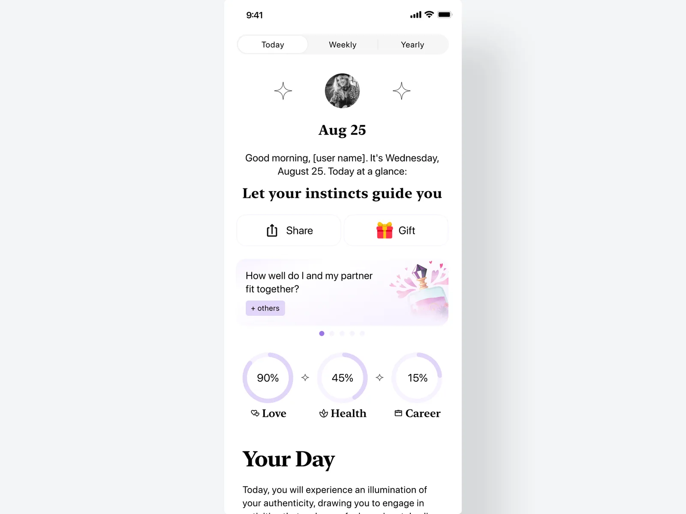
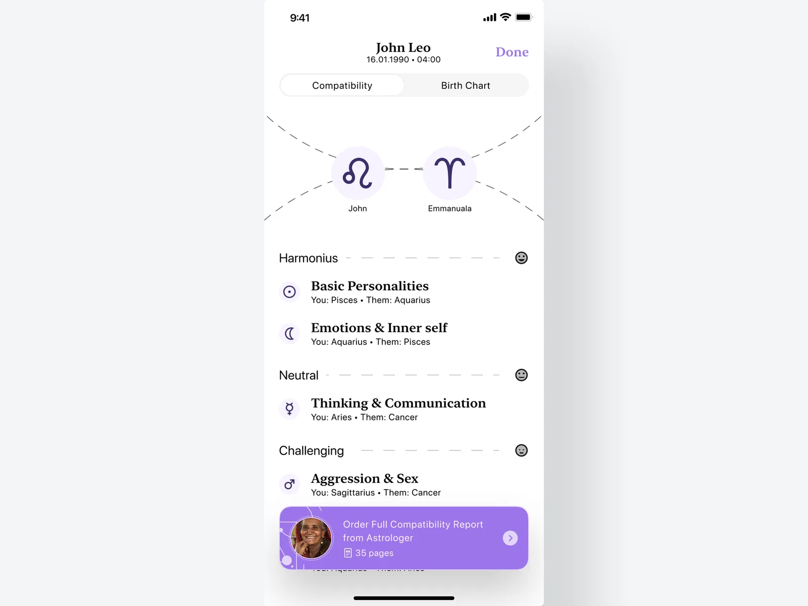
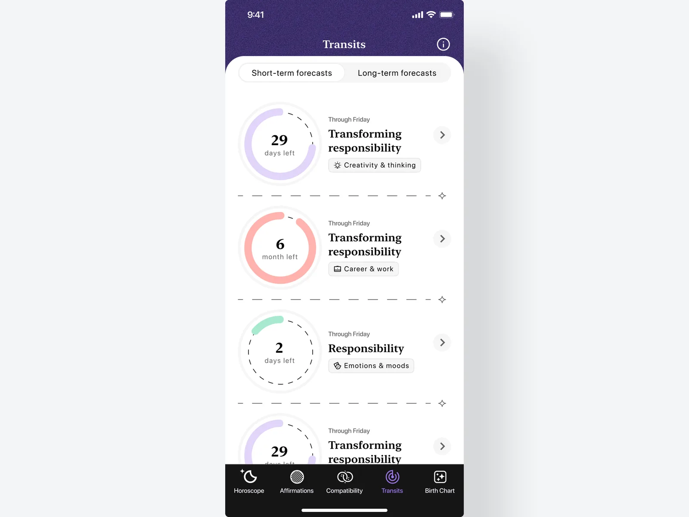
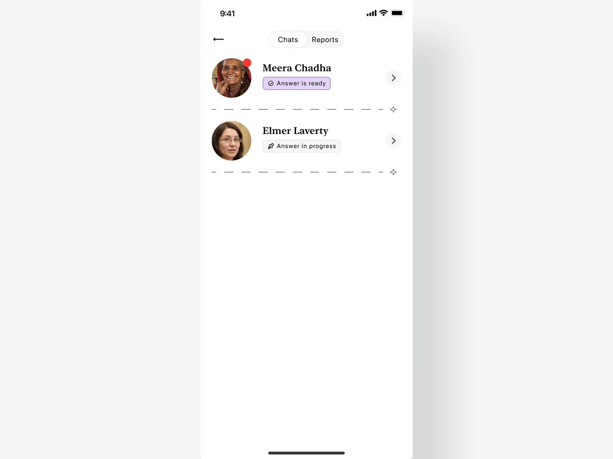

<!-- ARCHIVED 2026-08-31. Pulled from the home page and unpublished while the
     portfolio narrows to two cases done properly: Calorie Counter and Stream
     Vision II. Nothing here is deleted — the draft, its composition spec and
     its rendered figures all stand, and the open work is recorded in
     references/compose-plan.md: no Astro screenshots for the before/after,
     and a second interview needed for the depth the draft does not have. -->

## Context

Serene started as Astro, one of several interchangeable horoscope apps I
was already building at Kiss My Apps — the same UA-funnel playbook every
app in the category ran: buy paid traffic, hook on a generic daily
horoscope, hope retention held long enough to be profitable. It worked,
but it was a commodity. Nothing about the product itself pulled anyone
back, and the whole business depended on paid acquisition staying cheap.

## The problem

By 2021 the company wanted an app that behaved like a brand, not a funnel
— something with pull independent of ad spend. The numbers pointed at a
niche most horoscope apps ignored: women and LGBTQ+ users who wanted
astrology as a lifestyle and compatibility lens, not a fortune-cookie
push notification. Astro's generic UI and voice had nothing to say to
that audience — there was no product to point at and say "this is who
it's for."

## A brand, not a funnel

The rebrand cut dark mode entirely — a white UI, serif display type, and
collage-style imagery styled after what was trending on Pinterest and
Instagram moodboards at the time. The bet was aesthetic, not functional:
Gen Z was visibly gravitating toward that collage look, and none of the
generic horoscope apps, Astro included, were touching it.

## Talk to an astrologer, then pay

The AI astrologer chat became the paywall moment. The mechanic was to
pull the user into an actual back-and-forth exchange with the bot before
ever mentioning a subscription, then gate the reading right as they were
mid-conversation, waiting for an answer. It converted well. It's also the
exact pattern App Store reviewers call out as pushy — asked to pay
mid-compatibility-check, before seeing any real value. Both are true at
once: it worked, and it's the app's most consistent complaint.

## Web2app: paying before the install

The growth engine sat entirely outside the app: a long onboarding quiz —
birth date, birth place, relationship questions — hosted on the web, with
encouraging copy at nearly every step telling the user their life was
about to get better, to keep completion high through a genuinely long
data-collection flow. It ended in a personalized report gated by a
subscription paywall, charged on the web, before the user ever opened the
native app — so that revenue never went through Apple's or Google's cut.
By the end of the project this funnel was bringing in 42% of leads.

## Affirmations that didn't land, at first

Not every bet worked on the first try. The Affirmation Challenge flow
didn't land with users when it first shipped — engagement was weak enough
that it needed a real rebuild, not a tweak. We rebuilt it as a gamified
challenge over a few iterations, and by version 3 it was lifting Day-7
retention.

## Outcome

By the end of the project, Serene had grown into a $2M ARR product. Its
iOS rating climbed from poor to 4.7★ — a direct result of the redesign,
not a number the rebrand happened to inherit. And 42% of its leads were
coming through the web2app funnel, converting to paying subscribers
before a dollar went through Apple's or Google's cut.

<figure class="figure carousel">
  

    
    
    
    
  

  

    <button class="carousel__thumb" role="tab" aria-selected="true" type="button"></button>
    <button class="carousel__thumb" role="tab" aria-selected="false" type="button"></button>
    <button class="carousel__thumb" role="tab" aria-selected="false" type="button"></button>
    <button class="carousel__thumb" role="tab" aria-selected="false" type="button"></button>
  

</figure>

## Working with Kiss My Apps

> I worked with Ulad for 3 years at KissMyApps and during this time we
> implemented many interesting projects. It was a pleasure to work with
> Ulad in the same team. His vision and understanding of product design
> has helped us progress and grow as a company.
>
> — **Kirill Ganziienko**, Delivery Manager, Kiss My Apps

## What I'd change now

Android was always the afterthought — it rode along on whatever shipped
for iOS, rarely got its own testing, and it shows: it never matched
iOS's performance or rating. If I were doing this again, Android would
get its own experiment budget instead of inheriting iOS's leftovers.

